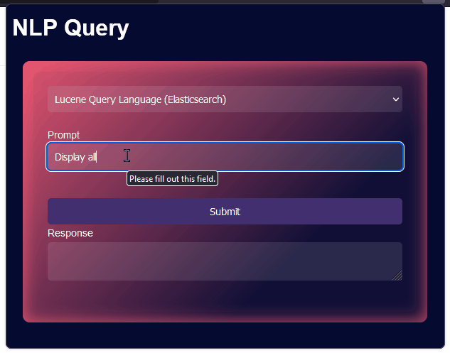

# NLP Query
A Firefox extension to translate natural language queries into search queries for various search engines.

---

## Load the Extension into Firefox
Clone the repository:
```bash
git clone git@github.com:christopherwoodall/nlp-query.git
```

Now you can load the extension into Firefox. Open Firefox and go to `about:debugging#/runtime/this-firefox`. Click "Load Temporary Add-on…" and select the `manifest.json` file located inside the `nlp-query/nlp-query` directory. Now you should see your extension in the list of extensions and in the browser's toolbar.

---

## Supported Query Languages
  - Lucene Query Language (Elasticsearch)",
  - SQL (McAfee's Enterprise Security Manager)",
  - Splunk's Search Processing Language (SPL)",
  - Azure Log Analytics Query Language (KQL)",
  - CQL (Cassandra Query Language)",

---

# Demo

